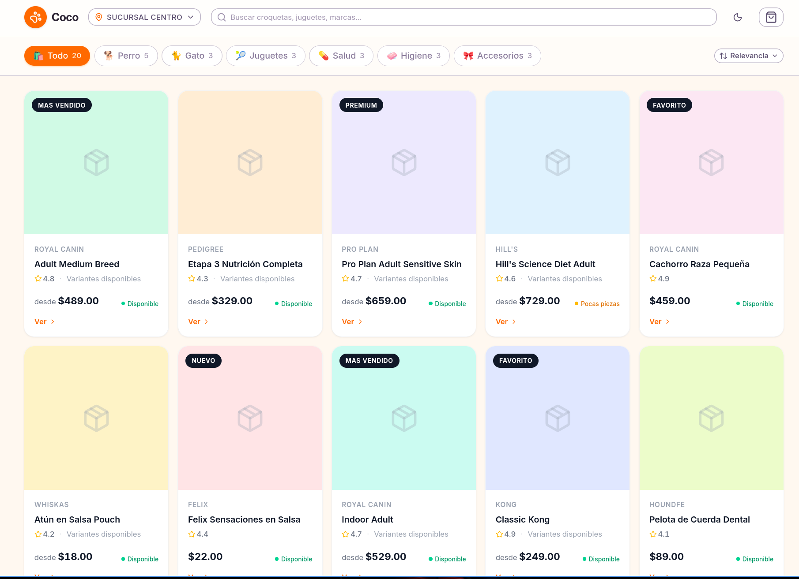

# Solicitud al Backend: Publicación de Catálogo Online (online-catalog-publishing)

> **Nota de alcance:** este documento es una solicitud formal de contratos y capacidades. Todas las sugerencias de modelado, endpoints y estructuras JSON son **no vinculantes**: el equipo de backend tiene la autoridad arquitectónica final sobre nombres, rutas, modelos de datos, patrones internos y decisiones de implementación. Lo que necesitamos del frontend son **contratos estables y evidencia**, no una implementación específica.

---

## 1. Resumen ejecutivo y objetivo de negocio

El frontend ya tiene un catálogo público construido (`/catalogo/:branchSlug?`), pero hoy es una demo servida con datos mock. El backend ya expone una API pública de catálogo real y aislada por tenant (`src/public-catalog/`), lo que permite una primera integración con datos reales **sin cambios en el backend** (técnicamente posible hoy, pero **pausada por decisión del producto**: ver nota de pausa en §3.3).

Sin embargo, para que un comercio pueda publicar su catálogo de forma segura faltan capacidades estructurales en el backend:

1. **Publicación a nivel tenant**: hoy todo tenant activo es públicamente descubrible. Necesitamos que la publicación del catálogo sea explícita (opt-in conservador).
2. **Publicación a nivel variante**: hoy no existe; toda variante de un producto publicado se expone.
3. **Listas de precios públicas seleccionables**: hoy la API pública usa siempre la lista global con `isDefault = true`. Necesitamos que el comercio marque una o más listas como públicas, elija un contexto de precio por visita y que el carrito se valide contra ese contexto.
4. **Política de presentación de stock**: hoy el estado público deriva siempre del stock operativo. Necesitamos modos de presentación configurables que **nunca** conviertan stock operativo cero en disponibilidad vendible.

**Objetivo de negocio:** que un comercio pueda abrir su catálogo online cuando lo decida, controlar exactamente qué se ve, a qué precio y con qué presentación de inventario, con un carrito validado siempre por el backend.

---

## 2. Estado actual de la UI (solo demo)



La captura muestra el catálogo actual. **Todo lo visible en ella es demo salvo la estructura de componentes:**

| Elemento visible                                | Estado real                                                                                    |
| ----------------------------------------------- | ---------------------------------------------------------------------------------------------- |
| Marca "Coco" en header/footer                   | Hardcodeada en `CatalogHeader.vue` / `CatalogFooter.vue`; no existe dato de marca del tenant   |
| Selector de 3 sucursales                        | Mock: tres tenants ficticios en `data/mock-catalog.ts`                                         |
| Categorías con emojis                           | Mapa fijo de emojis sobre IDs mock; los IDs reales de categoría son UUIDs que no coincidirán   |
| Ratings y badges "destacado"                    | Mock; el backend v1 devuelve `rating: null` y `featuredLabel: null`                            |
| Precios, stocks y disponibilidad multi-sucursal | Mock; el backend v1 devuelve una sola entrada de `availabilityByBranch` y nunca cantidad cruda |
| Placeholder de colores pastel                   | Utilidad de presentación; puede quedar como fallback visual, no como verdad de producto        |
| Botón de WhatsApp                               | Teléfono hardcodeado (`+5215512345678`), sin validación de carrito                             |

**Conclusión:** nada de esta pantalla debe considerarse compromiso de comportamiento final. La estructura de componentes (header, barra de categorías, grid, modal, drawer de carrito) se conserva; los datos y comportamientos se reemplazan por contratos reales.

---

## 3. Estado actual con evidencia exacta

### 3.1 Frontend (`frontend-houndfe`)

| Área                    | Ruta                                                                                              | Estado                                                                                          |
| ----------------------- | ------------------------------------------------------------------------------------------------- | ----------------------------------------------------------------------------------------------- |
| Ruta pública            | `src/app/router/index.ts` — `/catalogo/:branchSlug?`, `meta: { layout: 'catalog', public: true }` | Registrada; el slug no se sincroniza con la selección                                           |
| API de catálogo         | `src/features/catalog/api/catalog.api.ts`                                                         | `getBranches`, `getProducts`, `getProductDetail` devuelven **mock**                             |
| Datos mock              | `src/features/catalog/data/mock-catalog.ts`                                                       | 3 sucursales, 6 categorías emoji, 20 productos, ratings, labels, stocks por sucursal            |
| Store                   | `src/features/catalog/composables/useCatalogStore.ts`                                             | Importa `MOCK_CATEGORIES`; slug por defecto `centro`; sin estados de carga/error/paginación     |
| Carrito                 | `src/features/catalog/composables/useCatalogCart.ts`                                              | Carrito local sin persistir; teléfono WhatsApp hardcodeado; **nunca valida contra el backend**  |
| Tipos                   | `src/features/catalog/interfaces/catalog.types.ts`                                                | Ya espejan los DTOs públicos v1 del backend (lista, detalle, carrito)                           |
| HTTP autenticado        | `src/core/shared/api/http.ts`                                                                     | Inyecta bearer token y `no-cache` en GET: **no apto** para llamadas públicas anónimas con caché |
| Publicación de producto | `src/features/POS/products/**`                                                                    | Checkbox `includeInOnlineCatalog` end-to-end (tipos, form, payload, UI)                         |
| Publicación de variante | `src/features/POS/products/**`                                                                    | **No existe** ningún campo de publicación de variante en tipos ni formularios                   |
| Precio oculto           | `src/features/POS/products/**`                                                                    | `hidePriceInOnlineCatalog` **no expuesto** en DTOs autenticados ni UI                           |

### 3.2 Backend (`houndfe-backend`) — leído con permiso, solo como evidencia

| Hecho                                                                                                                     | Evidencia                                                                                                                                             |
| ------------------------------------------------------------------------------------------------------------------------- | ----------------------------------------------------------------------------------------------------------------------------------------------------- |
| Rutas públicas v1: branches, products, detail, cart/validate                                                              | `src/public-catalog/http/public-catalog.controller.ts`                                                                                                |
| Guard de tenant público + throttler por controller                                                                        | `src/public-catalog/http/guards/public-tenant.guard.ts`; `public-catalog.module.ts` (`public-browse` 60/min, `public-validate` 20/min)                |
| Caché pública (60s listas/detalle, 300s branches, `no-store` en cart)                                                     | Interceptor `CacheControlInterceptor` y anotaciones `@CacheControl('no-store')`                                                                       |
| Precio público siempre de la lista `isDefault = true`                                                                     | `prisma-public-catalog.repository.ts:108,122,216,229` y `validate-public-cart.use-case.ts:42,53` — `globalPriceList: { isDefault: true }` hardcodeado |
| `Product.includeInOnlineCatalog` con default `true`                                                                       | `prisma/schema.prisma:467`                                                                                                                            |
| `Product.hidePriceInOnlineCatalog` default `false`, leído por el mapper público pero **no expuesto** en DTOs autenticados | `prisma/schema.prisma:487`; `CreateProductDto`/`UpdateProductDto`/`ProductsService` no lo mapean                                                      |
| `Tenant.isActive Boolean @default(true)`, sin flag de publicación de catálogo                                             | `prisma/schema.prisma:332-339` (no existe `catalogPublished` ni equivalente)                                                                          |
| DTO de validación de carrito declara `globalPriceListId?` opcional pero el use case solo consume `items`                  | `http/request-dto/validate-cart-body.dto.ts:28`; `validate-public-cart.use-case.ts`                                                                   |
| Productos tipo `SERVICE` excluidos de queries públicas                                                                    | Repositorios públicos filtran `type = PRODUCT`                                                                                                        |
| Mapping de stock: `quantity <= 0 → out_of_stock`; `<= min → low_stock`; `useStock = false → available`                    | Casos de uso/repositorio públicos                                                                                                                     |

### 3.3 Integración ya posible hoy (sin cambios de backend)

Con los 4 endpoints públicos actuales el frontend puede: listar sucursales, listar/detalle con facets y paginación, renderizar imágenes reales, y validar carrito bloqueando `NOT_FOUND`, `NOT_IN_CATALOG`, `VARIANT_NOT_FOUND`, `OUT_OF_STOCK`. Ese es el "slice 1" y no depende de nada de este documento. Lo que sigue son las capacidades nuevas.

> **Nota de pausa (decisión del producto):** lo anterior describe **disponibilidad técnica**, no un plan de ejecución. Por decisión del usuario, **todo el frontend está pausado** — incluido este slice 1, que es técnicamente posible pero **no está agendado ni se implementará** hasta que el usuario reanude. La reanudación requiere una **instrucción explícita del usuario después** de que el backend devuelva contratos y evidencia; la respuesta del backend por sí sola no reactiva el trabajo. Hoy solo se entrega este documento de handoff.

---

## 4. Terminología y definiciones de modelo

| Término                                                                   | Definición propuesta                                                                                                                                                     |
| ------------------------------------------------------------------------- | ------------------------------------------------------------------------------------------------------------------------------------------------------------------------ |
| **Tenant / sucursal**                                                     | Hoy `Tenant` = sucursal (v1). Un producto pertenece a un tenant. `isActive` es un estado **operativo**, no de publicación.                                               |
| **Publicación de catálogo del tenant** (`catalogPublished` o equivalente) | Estado administrativo que decide si el tenant es descubrible y servible por la API pública. Es el **gate efectivo** de toda la superficie pública.                       |
| **Lista de precios global**                                               | `GlobalPriceList` existente (catálogo compartido, un único `isDefault`, "PUBLICO" protegida).                                                                            |
| **Lista de precios pública**                                              | Lista global que el tenant marca explícitamente como visible en su catálogo. Marcarla es una decisión del tenant, por lista.                                             |
| **Lista de precios privada**                                              | Cualquier lista global no marcada pública por ese tenant. No debe ser enumerable ni inferible desde ninguna API pública.                                                 |
| **Lista por defecto del catálogo**                                        | Una de las listas públicas del tenant, elegida por el tenant, usada como contexto de precio inicial de la visita.                                                        |
| **Contexto de precio seleccionado**                                       | La lista pública que el visitante eligió para su visita/carrito. Es **autoritativo del backend**: el frontend la propone, el backend resuelve y recalcula.               |
| **Publicación efectiva de producto**                                      | `catalogPublished(tenant) AND includeInOnlineCatalog(product) AND type = PRODUCT`. Conmutativa en fallo: si cualquiera es falsa, el producto no existe públicamente.     |
| **Publicación efectiva de variante**                                      | Publicación efectiva del producto **AND** publicación de la variante (con herencia y override, ver §7).                                                                  |
| **Stock operativo**                                                       | Cantidad real interna (`quantity`, `minQuantity`, lotes) usada para fulfillment y validación de carrito. Nunca se expone cruda salvo modo explícito de cantidad pública. |
| **Stock de presentación**                                                 | Lo que el catálogo muestra: estado del sistema, estado abstracto, cantidad pública custom u oculto. Solo presentación; nunca autoriza fulfillment.                       |

---

## 5. Reglas de negocio y matrices de precedencia

### 5.1 Matriz de visibilidad efectiva (descubrimiento y listado)

| Tenant publicado | Tenant activo | Producto publicado | Tipo PRODUCT | Variante publicada (efectiva) | Resultado público                                                                                                |
| ---------------- | ------------- | ------------------ | ------------ | ----------------------------- | ---------------------------------------------------------------------------------------------------------------- |
| ✗                | cualquier     | cualquier          | cualquier    | cualquier                     | **Tenant invisible**: branches 404/vacío, list/detail/cart no resuelven el slug                                  |
| ✓                | ✓             | ✗                  | ✓            | cualquier                     | Producto excluido de list; detail → 404; item de carrito → `NOT_IN_CATALOG`                                      |
| ✓                | ✓             | ✓                  | ✗ (SERVICE)  | cualquier                     | Excluido de todo lo público (comportamiento actual, mantener)                                                    |
| ✓                | ✓             | ✓                  | ✓            | ✗                             | Producto aparece; **variante omitida** de detalle/listado; item de carrito con esa variante → rechazo (ver §5.3) |
| ✓                | ✓             | ✓                  | ✓            | ✓                             | Visible y agregable al carrito                                                                                   |

### 5.2 Matriz de precedencia de precio público

| Condición (en orden)                                                              | Efecto                                                                                                                                                              |
| --------------------------------------------------------------------------------- | ------------------------------------------------------------------------------------------------------------------------------------------------------------------- |
| Precio oculto efectivo (`hidePriceInOnlineCatalog` OR `requiresPrescription`)     | Todos los campos numéricos y totales públicos → `null`. Precedencia máxima.                                                                                         |
| Producto/variante no soporta la lista seleccionada (no tiene precio en esa lista) | Excluido del resultado de esa lista. **Nunca fallback** a otra lista ni al default.                                                                                 |
| Precio en lista seleccionada = 0 o faltante                                       | Regla explícita definida por backend (ver pregunta abierta §18-Q3). Sugerencia: excluir del listado de esa lista y rechazar el item en carrito con código dedicado. |
| Lista seleccionada no es pública / no pertenece al tenant / no existe             | Rechazo explícito del request (400/422 con código), sin exponer cuáles listas privadas existen.                                                                     |
| Contexto normal                                                                   | Precio desde la fila de precio (producto o variante) de la lista seleccionada; carrito siempre recalculado por el backend.                                          |

### 5.3 Matriz de stock operativo vs presentación (regla de oro)

| Stock operativo real    | Presentación configurada                                 | Mostrar                                                                                | ¿Carrito permite?               |
| ----------------------- | -------------------------------------------------------- | -------------------------------------------------------------------------------------- | ------------------------------- |
| > 0                     | Cualquier modo                                           | Según modo                                                                             | Sí (sujeto a validación normal) |
| 0                       | `SYSTEM_STATUS`                                          | `out_of_stock`                                                                         | **No** (`OUT_OF_STOCK`)         |
| 0                       | `ABSTRACT_STATUS` ("agotado" abstracto)                  | Estado abstracto agotado                                                               | **No**                          |
| 0                       | `ABSTRACT_STATUS` "disponible"                           | Backend **debe** resolver a agotado: el estado abstracto no puede crear disponibilidad | **No**                          |
| 0                       | `CUSTOM_QUANTITY`                                        | La cantidad custom si el modo lo permite, pero el estado efectivo es agotado           | **No**                          |
| 0                       | `HIDDEN`                                                 | Sin indicador de stock                                                                 | **No**                          |
| bajo (`<= minQuantity`) | cualquier modo distinto de presentación de cantidad real | `low_stock` o equivalente abstracto; nunca cantidad cruda                              | Sí, con warning                 |
| `useStock = false`      | cualquier modo                                           | `available`                                                                            | Sí                              |

**Invariante central:** el stock operativo cero **siempre** gana y bloquea la validación de carrito. Ningún modo de presentación puede convertir stock cero en vendible. La presentación nunca filtra cantidades operativas reales salvo que el modo custom lo permita explícitamente (y aun entonces es valor de presentación, no operativa).

---

## 6. Expectativas de configuración

### 6.1 Tenant (nueva pantalla de configuración de catálogo)

- Publicación del catálogo: on/off (default conservador: **off**).
- Listas de precios públicas: selección múltiple entre las listas globales existentes + elección de la lista por defecto del catálogo.
- Datos de contacto/mano futura: nombre visible, teléfono de WhatsApp normalizado, horarios, métodos de fulfillment (pickup/delivery), políticas — **opcional/fase posterior**, solo documentado aquí.
- Permisos: sugerimos un permiso administrativo propio (o reutilizar el de gestión de tenant); **no** debe otorgarse implícitamente a todo editor de productos.

### 6.2 Producto (extiende lo existente)

- `includeInOnlineCatalog`: ya existe end-to-end, se conserva tal cual.
- `hidePriceInOnlineCatalog`: necesita round-trip autenticado (GET/PATCH) — hoy es solo columna + lectura pública.
- Listas públicas soportadas: el producto elige una o más de las listas públicas del tenant (default sugerido: hereda todas).
- Política de presentación de stock del producto (modo + valor custom si aplica).
- Si la variante no define override, hereda todo del producto.

### 6.3 Variante (nuevo)

- Publicación de variante (heredada del producto al crear; override explícito posible).
- Override de política de presentación de stock (opcional).
- Override de listas públicas soportadas (opcional).
- Sin campos nuevos obligatorios: el comportamiento por defecto debe ser "hereda del producto".

---

## 7. Múltiples listas de precios públicas

### 7.1 Allowlist y herencia

1. El tenant marca N listas globales como públicas y elige 1 por defecto. Las listas no marcadas son privadas para ese tenant.
2. Cada producto declara qué listas públicas soporta (por defecto: todas las públicas del tenant). La variante hereda; puede override.
3. Una lista solo es usable como contexto si es pública para el tenant **y** soportada por el producto/variante.

### 7.2 Selector del visitante

- Un **selector global único** por visita: el visitante elige una lista pública al entrar y esa selección gobierna listado, detalle y carrito.
- La selección vive en el frontend (URL/query/state) y viaja al backend como parámetro/estructura propuesta; el backend la resuelve contra su allowlist.
- Cambiar de lista a mitad de visita dispara re-lectura del listado y re-validación del carrito en el nuevo contexto.

### 7.3 Filtrado y no-fallback

- Si un producto/variante no soporta la lista seleccionada → **excluido** del resultado de esa lista (no aparece con precio de otra lista).
- Nunca se sustituye silenciosamente por la lista por defecto ni por ninguna otra. El frontend tampoco debe inventar precios.
- El listado responde con la metadata del contexto usado (qué lista se aplicó) para que la UI pueda etiquetar el resultado.

### 7.4 Binding del carrito

- La validación de carrito recibe el contexto de lista seleccionado y recalcula **todos** los precios y el total contra esa lista, ignorando cualquier precio que el cliente haya mostrado o enviado.
- El carrito no puede mezclar contextos: un carrito se valida completo contra una sola lista pública. Si el contexto cambió, la respuesta puede incluir advertencias/ajustes y el frontend re-sincroniza.
- El DTO actual ya declara `globalPriceListId?` en `ValidateCartBodyDto` — propuesta: usarlo (o su reemplazo) como campo del contexto seleccionado y validarlo contra el allowlist público del tenant.

### 7.5 No divulgación de listas privadas

- Ninguna API pública puede enumerar listas privadas, ni exponer sus nombres/IDs, ni permitir inferirlas (p. ej., mediante diferencias de resultados, códigos de error que distingan "lista privada" de "lista inexistente", o validación de carrito que revele precios de listas no públicas).
- Un ID de lista privada enviado a un endpoint público debe tratarse como **lista inexistente/no permitida** (mismo código y mensaje), sin filtrar detalles.

---

## 8. Presentación de stock: modos y herencia

### 8.1 Modos propuestos (nombres orientativos)

| Modo                             | Qué muestra el catálogo                                                                                  |
| -------------------------------- | -------------------------------------------------------------------------------------------------------- |
| `SYSTEM_STATUS` (default actual) | `available` / `low_stock` / `out_of_stock` derivado del stock operativo, sin cantidades                  |
| `ABSTRACT_STATUS`                | Estado abstracto elegido por el comercio (p. ej., "disponible"/"bajo pedido") — nunca implica stock real |
| `CUSTOM_QUANTITY`                | Cantidad pública definida por el comercio (entero ≥ 0), separada del stock operativo                     |
| `HIDDEN`                         | Sin indicador de stock                                                                                   |

### 8.2 Herencia y override

- Producto define modo (+ valor custom si aplica). Variante hereda; puede override explícito.
- Producto con variantes: sugerimos resolver por agregación del estado efectivo de variantes publicadas (regla actual: disponible si alguna disponible; bajo si alguna bajo; agotado si todas agotadas) — backend decide el detalle.

### 8.3 Seguridad de stock cero

Ver matriz §5.3. Repetido como regla de implementación: la validación de carrito consulta **siempre** el stock operativo, independiente del modo de presentación. `useStock = false` sigue significando siempre disponible. La cantidad pública custom nunca escribe ni sustituye al stock operativo.

---

## 9. APIs solicitadas

> Los shapes son propuestas. El backend define los finales; el frontend se adaptará a la documentación/evidencia que devuelva.

### 9.1 Autenticadas (admin)

#### A. Configuración de catálogo del tenant

| Método  | Path sugerido                         | Descripción                                                                                           |
| ------- | ------------------------------------- | ----------------------------------------------------------------------------------------------------- |
| `GET`   | `/tenants/:tenantId/catalog-settings` | Lee la configuración (publicación, listas públicas, default, presentación de stock default, contacto) |
| `PATCH` | `/tenants/:tenantId/catalog-settings` | Actualiza parcialmente                                                                                |

```json
// GET response (propuesta)
{
  "catalogPublished": false,
  "publicPriceLists": [
    { "globalPriceListId": "uuid-1", "name": "PUBLICO", "isDefault": true },
    { "globalPriceListId": "uuid-2", "name": "Mayorista", "isDefault": false }
  ],
  "defaultPublicPriceListId": "uuid-1",
  "stockPresentationDefault": "SYSTEM_STATUS",
  "contact": { "displayName": "Farma Centro", "whatsappPhone": "+52...", "hours": null }
}
```

```json
// PATCH body (propuesta, parcial)
{
  "catalogPublished": true,
  "publicPriceListIds": ["uuid-1", "uuid-2"],
  "defaultPublicPriceListId": "uuid-1"
}
```

**Semántica de errores sugerida:** `400` si la lista default no está entre las públicas; `404` si el tenant no existe o no pertenece al caller; `422` para valores inválidos (teléfono no normalizable, modo de stock desconocido). La operación de despublicar debe ser instantánea e invalidar/afectar el caché público (ver §9.3).

#### B. Round-trip de producto autenticado

- `GET/PATCH /products/:id` deben incluir: `hidePriceInOnlineCatalog`, listas públicas soportadas (o política de herencia), modo de presentación de stock + valor custom. Validaciones: modo enum estricto, cantidad custom ≥ 0, listas deben ser públicas del tenant.

#### C. Round-trip de variante autenticado

- `GET/PATCH /variants/:id` (o el path actual de variantes) deben incluir: `includeInOnlineCatalog` (herencia/override explícito — sugerimos `null` = hereda, `boolean` = override, o un enum `INHERIT|ON|OFF`), override de stock presentation, override de listas.

### 9.2 Públicas (extensiones)

#### A. Descubrimiento de sucursales filtrado por publicación

`GET /public/catalog/branches` → solo tenants con catálogo publicado (además de activos).

```json
[{ "id": "uuid", "name": "Sucursal Centro", "slug": "centro", "address": "...", "phone": "..." }]
```

#### B. Contexto de precio en listado y detalle

`GET /public/catalog/:tenantSlug/products?priceListId=uuid&...` y `GET .../products/:productId?priceListId=uuid`

- Si `priceListId` está ausente → lista por defecto del catálogo del tenant.
- Si `priceListId` no es pública del tenant o no existe → **mismo** error genérico que "no permitida" (evita enumerar privadas):

```json
// 400/422 (propuesta)
{ "statusCode": 400, "code": "PRICE_CONTEXT_NOT_AVAILABLE" }
```

- Respuesta con metadata de contexto:

```json
{
  "priceContext": { "priceListId": "uuid-1", "name": "PUBLICO", "isDefault": true },
  "items": [
    /* productos con priceCents de ESTA lista; los no soportados: excluidos */
  ]
}
```

- Los productos sin precio válido en la lista seleccionada se excluyen del `items` (no-fallback), o se devuelven con marca de exclusión si el backend prefiere explicitarlo.

#### C. Validación de carrito con contexto

`POST /public/catalog/:tenantSlug/cart/validate`

```json
// request (propuesta)
{
  "priceListId": "uuid-1",
  "items": [{ "productId": "uuid-p1", "variantId": "uuid-v1", "quantity": 2 }]
}
```

```json
// response (propuesta)
{
  "valid": false,
  "priceContext": { "priceListId": "uuid-1", "name": "PUBLICO" },
  "items": [
    {
      "productId": "uuid-p1",
      "variantId": "uuid-v1",
      "quantity": 2,
      "status": "VARIANT_NOT_IN_CATALOG",
      "blocking": true
    }
  ],
  "totalCents": null,
  "warnings": []
}
```

Códigos de bloqueo esperados (proponemos extender los existentes `NOT_FOUND`, `NOT_IN_CATALOG`, `VARIANT_NOT_FOUND`, `OUT_OF_STOCK` con): `PRICE_CONTEXT_NOT_AVAILABLE`, `VARIANT_NOT_IN_CATALOG` (variante no publicada), `PRICE_NOT_AVAILABLE_IN_CONTEXT` (producto soportado por contexto pero sin precio en él). Low stock y hidden price siguen siendo no-bloqueantes.

### 9.3 Caché, rate limits, aislamiento, concurrencia

| Aspecto                | Expectativa                                                                                                                                                                                                                                                              |
| ---------------------- | ------------------------------------------------------------------------------------------------------------------------------------------------------------------------------------------------------------------------------------------------------------------------ |
| Caché                  | Listas/detalle cacheables como hoy (60s) **más** clave de caché sensible al contexto de precio. `branches` 300s pero invalidada (o TTL corto) al despublicar un tenant: la despublicación debe efectivar en ≤ TTL. Cart/validate sigue `no-store`.                       |
| Rate limits            | Igual que hoy: browse 60/min, validate 20/min por IP; sugerimos mantener los nombres de scope actuales.                                                                                                                                                                  |
| Aislamiento por tenant | Todo query autenticado y público sigue aislado por tenant; el `priceListId` debe validarse contra el tenant del slug en cada request.                                                                                                                                    |
| Idempotencia           | Cart/validate sigue siendo stateless e idempotente (sin efectos secundarios).                                                                                                                                                                                            |
| Concurrencia           | PATCH de settings concurrentes: última escritura gana es aceptable; lo crítico es que publicar/despublicar sea atómico y consistente con los caches. Cambios de precio/lista durante una sesión no deben romper el carrito: la revalidación del backend es la autoridad. |
| Permisos               | Productos/variantes publican con `update:Product` (actual). Configuración de catálogo del tenant: permiso administrativo dedicado o de tenant-management — decisión del backend/producto.                                                                                |

---

## 10. Validación de carrito público bajo contexto de precio — requisitos consolidados

1. El carrito se valida **siempre** server-side; el total mostrado antes de validar es solo referencia.
2. El contexto de precio seleccionado viaja con cada validación y se valida contra el allowlist público del tenant.
3. Publicación efectiva (tenant → producto → variante) se re-verifica en cada validación, no se confía en lecturas previas.
4. El stock operativo se consulta siempre; stock cero bloquea sin importar presentación.
5. Precio oculto efectivo → totales/precios numéricos `null` y sin fallback.
6. Sin fallback de listas: precio solo desde la lista del contexto; precio ausente/cero en contexto = rechazo/exclusión explícita.
7. La respuesta contiene todo lo que la UI necesita para reconciliar ítems, precios, warnings y total (los precios del cliente se descartan).
8. La validación no crea estado (stateless), idempotente, `no-store`.

---

## 11. Migración y backfill (propuesta conservadora)

| Paso                                | Propuesta                                                                                                                                                                                                         | Riesgo cubierto                                                       |
| ----------------------------------- | ----------------------------------------------------------------------------------------------------------------------------------------------------------------------------------------------------------------- | --------------------------------------------------------------------- |
| M1. Flag de publicación de catálogo | Columna nueva con **default `false`** (opt-in). Los tenants existentes quedan NO descubribles hasta activación explícita.                                                                                         | Fuga de inventario existente (hoy cualquier tenant activo es público) |
| M2. Default de producto             | `includeInOnlineCatalog` se mantiene (`true`) pero **queda subordinado** al flag del tenant: sin tenant publicado, nada es público. No cambiamos el default del producto para no romper POS ni semántica interna. | Migración traumática                                                  |
| M3. Publicación de variantes        | Backfill: `INHERIT`/null (hereda del producto) para todas las variantes existentes.                                                                                                                               | Variantes invisibles o expuestas inesperadamente                      |
| M4. Listas públicas                 | Backfill: marcar la lista default actual (`PUBLICO`, `isDefault = true`) como pública y default del catálogo para cada tenant; el resto de listas quedan privadas por defecto.                                    | Pérdida de precios públicos al introducir el contexto                 |
| M5. Presentación de stock           | Backfill: `SYSTEM_STATUS` para todos los productos/variantes = comportamiento actual idéntico.                                                                                                                    | Cambio de comportamiento visible                                      |
| M6. Precio oculto                   | Backfill: valor existente (`false`), ahora round-tripeable autenticado.                                                                                                                                           | —                                                                     |
| M7. Rollback del esquema            | Si un tenant queda publicado sin precios válidos en su lista default (filas faltantes/0): regla explícita backend (sugerencia: producto sin precio → excluido de esa lista, no público con precio 0).             | Precios $0 visibles por error                                         |

El sistema aún no está en producción con datos reales, lo que permite migraciones limpias; aun así pedimos que los defaults sean los conservadores descritos.

---

## 12. Modelo de datos — opciones, no comandos

El backend elige el diseño; estas son opciones que encajan con el esquema actual:

- **Publicación de catálogo:** columna `catalogPublished Boolean @default(false)` en `Tenant` — opción simple y suficiente. Alternativa: tabla de settings de tenant si crecerá a branding/contacto (recomendado si se planifica la fase premium).
- **Listas públicas:** sugerimos tabla de join `TenantPublicPriceList (tenantId, globalPriceListId, isDefaultCatalog, ...)` con unicidad `(tenantId, globalPriceListId)` y restricción de un solo default por tenant. Alternativa: flag en `GlobalPriceList` — no recomendado porque la visibilidad es por tenant.
- **Publicación de variante:** columna en `ProductVariant` con semántica herencia/override (`INHERIT|ON|OFF` o nullable boolean) + índice compuesto para queries públicas `(productId, includeInOnlineCatalog)`.
- **Stock presentation:** enum + campos opcionales (custom quantity) en `Product` y `ProductVariant`, con la cantidad custom **separada** de `quantity` operativa.
- **Soporte de listas por producto:** join `ProductPriceListVisibility (productId, globalPriceListId)` o campo exclusión sobre el default "todas las públicas" — decisión del backend según volumen de filas.
- **Servicios públicos:** si algún día los `SERVICE` deben publicarse, es un cambio explícito de contrato; hoy pedimos mantener la exclusión.

---

## 13. Invariantes de validación, seguridad y privacidad

1. **No enumeración de listas privadas:** ninguna API pública expone existencia, nombres, IDs ni precios de listas no marcadas públicas por el tenant. Errores de contexto indistinguibles entre "inexistente" y "privada".
2. **No enumeración de recursos no publicados:** productos/variantes/tenants no publicados responden 404/exclusión, sin distinguir "no existe" de "no publicado" cuando sea posible (el caso de carrito es la excepción: códigos de bloqueo explícitos para el propio usuario).
3. **Aislamiento por tenant** en cada query autenticada y pública; el contexto de precio se valida contra el tenant del request, nunca confiado al cliente.
4. **El backend es la autoridad de precios y stock:** el cliente nunca autoriza precios, contexts ni disponibilidad.
5. **Stock operativo privado:** cantidades reales nunca en respuestas públicas salvo modo `CUSTOM_QUANTITY` (valor de presentación, no operativo).
6. **Zero-stock safety:** stock operativo 0 bloquea carrito siempre (§5.3).
7. **Herencia no expansiva:** un override de variante nunca puede ampliar visibilidad más allá de la publicada por su producto/tenant.
8. **Inputs validados:** `priceListId` UUID válido y permitido; cantidad custom ≥ 0; teléfonos normalizados server-side o devueltos canónicos; enums estrictos (class-validator/DTO).
9. **Rate limit y `no-store`** en cart/validate se preservan; caché público sensible al contexto de precio.
10. **Auditoría:** cambios de publicación (tenant/producto/variante) y de listas públicas recomendamos queden auditables (quién, cuándo).

---

## 14. Matriz de aceptación — pruebas/evidencia que pedimos devolver

| #   | Categoría            | Evidencia esperada                                                                                                                                 |
| --- | -------------------- | -------------------------------------------------------------------------------------------------------------------------------------------------- |
| T1  | Tenant no publicado  | Tenant activo pero no publicado: no aparece en branches; list/detail/cart con su slug → 404/errores públicos genéricos                             |
| T2  | Aislamiento          | Tenant A no puede leer/mutar settings ni publicar recursos de Tenant B (autenticado)                                                               |
| T3  | Publicación efectiva | Matriz §5.1 completa: combinaciones tenant/producto/tipo/variante y su efecto en branches, list, detail, cart                                      |
| T4  | Herencia variante    | Variante hereda por defecto; override ON/OFF; override no expande visibilidad del producto no publicado                                            |
| T5  | Contexto de precio   | List/detail/cart consistentes para cada lista pública del tenant; metadata de contexto correcta en las 3 superficies                               |
| T6  | No-fallback          | Producto sin precio en lista seleccionada: excluido del listado de esa lista; NO aparece con precio de otra; carrito rechaza el ítem               |
| T7  | Listas privadas      | `priceListId` privado/inexistente → mismo código de error; sin enumeración de listas privadas en ninguna respuesta pública                         |
| T8  | Precio oculto        | `hidePriceInOnlineCatalog` y `requiresPrescription`: campos numéricos y total `null` en list/detail/cart; precedencia sobre cualquier lista        |
| T9  | Stock presentation   | Cada modo × stock > 0 / bajo / 0: presentación correcta y **bloqueo de carrito con stock 0 en todos los modos**                                    |
| T10 | Custom quantity      | Cantidad pública nunca muta stock operativo; jamás habilita venta con stock real 0                                                                 |
| T11 | Migración/backfill   | Tests de migración: tenants existentes no descubribles tras M1; variante `INHERIT` tras M3; lista default pública tras M4; `SYSTEM_STATUS` tras M5 |
| T12 | Permisos             | `update:Product` para producto/variante; permiso de settings de tenant no otorgado a editores de producto salvo decisión explícita                 |
| T13 | Caché/rate limit     | Caché sensible a contexto; despublicación efectiva dentro del TTL; cart `no-store` y 20/min; browse 60/min                                         |
| T14 | Contratos            | Snapshots o actualización de `docs/backend-responses/public-online-catalog-frontend-guide.md` para cada DTO público/autenticado cambiado           |

---

## 15. Checklist de dependencias del frontend (qué necesitamos para reanudar)

Antes de retomar specs/design/tasks del frontend para las capacidades 2–4, necesitamos:

- [ ] Contrato final (DTO + ejemplo JSON) de configuración de catálogo del tenant (GET/PATCH) y su permiso.
- [ ] Contrato final autenticado de producto con `hidePriceInOnlineCatalog`, listas soportadas y stock presentation round-trip.
- [ ] Contrato final autenticado de variante con publicación (herencia/override) y overrides.
- [ ] Contrato final público de branches filtrado por publicación (código de error para slug no publicado).
- [ ] Contrato final de listado/detalle con parámetro de contexto de precio + shape de `priceContext` + semántica de exclusión.
- [ ] Contrato final de cart/validate con contexto de precio, códigos de bloqueo nuevos y shape de reconciliación.
- [ ] Regla explícita para precio faltante/0 en lista seleccionada (exclusión vs marca).
- [ ] Definición final de herencia/override de variante (nullable boolean vs enum) y de agregación de stock en productos con variantes.
- [ ] Comportamiento de caché/invalidación al despublicar y al cambiar listas públicas.
- [ ] Evidencia de la matriz T1–T14 (o lo que el backend considere equivalente).
- [ ] Guía frontend actualizada (`public-online-catalog-frontend-guide.md` o sucesora).

Mientras tanto, **el frontend permanece pausado** por decisión del producto: aunque el slice 1 (integración con los endpoints v1 existentes) es técnicamente posible sin nada de esta lista, **no está agendado ni se implementará** hasta que el usuario reanude explícitamente el trabajo después de recibir estos contratos y la evidencia.

---

## 16. Entrega por fases recomendada y compatibilidad

| Fase              | Contenido backend                                                                                                                           | Compatibilidad                                                                                                          |
| ----------------- | ------------------------------------------------------------------------------------------------------------------------------------------- | ----------------------------------------------------------------------------------------------------------------------- |
| **F1**            | Migración M1–M6 con defaults conservadores; round-trip autenticado (settings tenant, producto, variante); branches filtrado por publicación | Los endpoints públicos v1 siguen funcionando igual (precio = lista default): cero breaking para el slice 1 del frontend |
| **F2**            | Contexto de precio público: parámetro en list/detail, binding en cart, allowlists, no-fallback, caché por contexto                          | Sin parámetro → comportamiento F1 (lista default). Retrocompatible                                                      |
| **F3**            | Stock presentation público efectivo + validaciones de herencia/override                                                                     | Backfill `SYSTEM_STATUS` = sin cambio observable                                                                        |
| **F4 (opcional)** | Branding/contacto/metadata premium, slugs, SEO                                                                                              | Independiente                                                                                                           |

Cada fase debería llegar con su guía/contratos actualizados; el frontend consume por fase en el mismo orden.

---

## 17. No-goals / diferidos explícitos

- **WhatsApp bot y creación de órdenes:** la conversión final irá al bot en desarrollo. Este documento solo fija la frontera futura (el carrito validado y el contexto de contacto del tenant serán las entradas probables). **No se pide** ningún workflow temporal de teléfono ni endpoint de órdenes.
- **Ratings/reseñas y featured labels:** sin fuente confiable ni moderación; fuera de alcance.
- **Rediseño visual del catálogo:** no se reabre. Nota de relación: el SDD `products-catalog-coco` (migración visual de tokens de gestión de productos POS) está completo y es **independiente y no relacionado** con esta iniciativa; excluyó explícitamente `src/features/catalog/` y **no** creó la topología de componentes del catálogo público ni su demo. Esta iniciativa no lo enmienda ni lo reemplaza. El demo público actual proviene únicamente de la implementación existente en `src/features/catalog/`.
- **Servicios (`SERVICE`) públicos:** se mantiene la exclusión salvo decisión futura explícita.
- **Tier prices públicos:** si algún día se publican, se resuelven server-side; no se pide en este ciclo.
- **Multi-sucursal real (inventario por sucursal):** v1 mantiene Tenant = sucursal.

---

## 18. Preguntas abiertas reservadas a la autoridad del backend

Estas no reabren decisiones de producto ya aprobadas; son vacíos que solo el backend puede definir:

1. **Q1 — Nombres/estructura:** nombres finales de entidades, campos y rutas (propusimos `catalogPublished`, `TenantPublicPriceList`, enums `SYSTEM_STATUS|ABSTRACT_STATUS|CUSTOM_QUANTITY|HIDDEN`).
2. **Q2 — Semántica de herencia:** representación preferida para herencia/override de variante (nullable vs enum) y si la creación de variante copia o referencia al producto.
3. **Q3 — Precio faltante/cero en lista seleccionada:** ¿excluir del listado, rechazar en carrito con código dedicado, o ambas? (Sugerimos ambas.)
4. **Q4 — Caché e invalidación:** estrategia preferida para que despublicar/ cambiar listas efectúe dentro del TTL (invalidación activa vs TTL corto).
5. **Q5 — Permisos:** permiso nuevo para settings de catálogo vs reutilizar uno existente; qué roles lo obtienen.
6. **Q6 — Agregación de stock en variantes:** regla final de agregación pública cuando variantes tienen overrides distintos.
7. **Q7 — Servicio y tasa:** si conviene un scope/nombre de throttler adicional para validación con contexto (hoy 20/min parece razonable).
8. **Q8 — Exclusión explícita en listado:** ¿los productos excluidos por contexto se omiten o se devuelven marcados? (Sugerimos omitir y exponer solo conteos si hace falta.)

---

## 19. Mensaje para acompañar el documento (copiar y pegar)

> Hola equipo 👋
>
> Les comparto la solicitud formal para la publicación del catálogo online: `docs/backend-requests/online-catalog-publishing.md`.
>
> En corto: el catálogo del frontend ya está construido y el backend v1 público ya nos alcanza para la primera integración con datos reales. Lo que necesitamos de ustedes son las capacidades que faltan para que un comercio publique su catálogo de forma segura: publicación explícita a nivel tenant (hoy todo tenant activo es descubrible), publicación de variantes, listas de precios públicas seleccionables con contexto de precio en el carrito (hoy siempre se usa la lista default), y presentación de stock configurable que nunca convierta stock real cero en vendible.
>
> El documento incluye reglas de negocio, matrices de precedencia, contratos propuestos (no vinculantes — la arquitectura final es de ustedes), propuesta de migración conservadora, matriz de pruebas que nos gustaría recibir como evidencia, y la checklist exacta de contratos que necesitamos para retomar el frontend. Las fases recomendadas F1→F3 son retrocompatibles con la v1 actual.
>
> Quedamos pausados en el frontend: **todo** el trabajo de frontend (incluida la integración con los endpoints v1 existentes) está detenido por decisión del producto. Cuando ustedes devuelvan los contratos y la evidencia, el usuario decidirá explícitamente cuándo y qué se reanuda; su respuesta no reactiva el trabajo automáticamente. ¡Gracias!

---

_Documento generado por el equipo frontend como solicitud formal. Las sugerencias de modelado son opciones abiertas; el equipo de backend tiene la última palabra arquitectónica._
